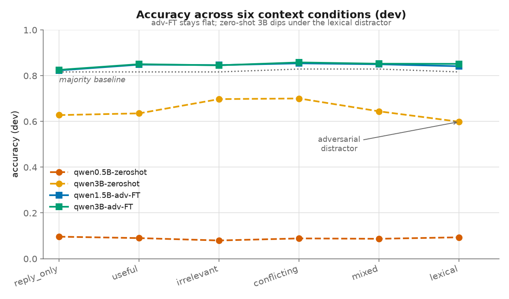
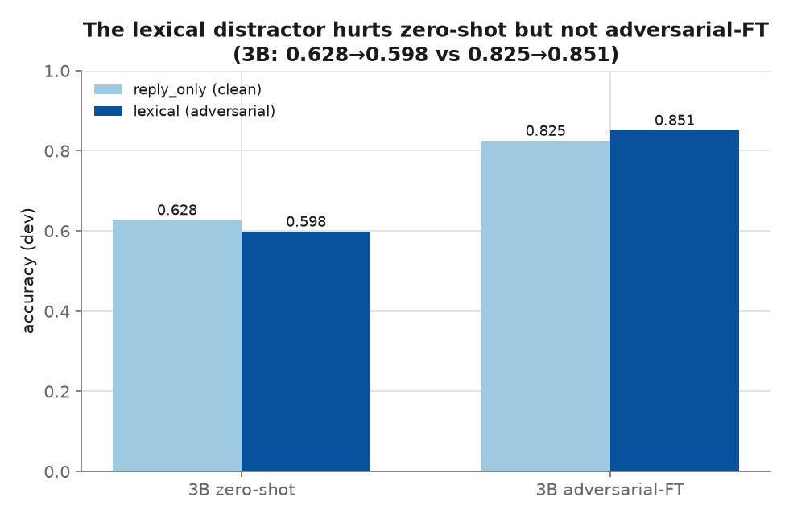
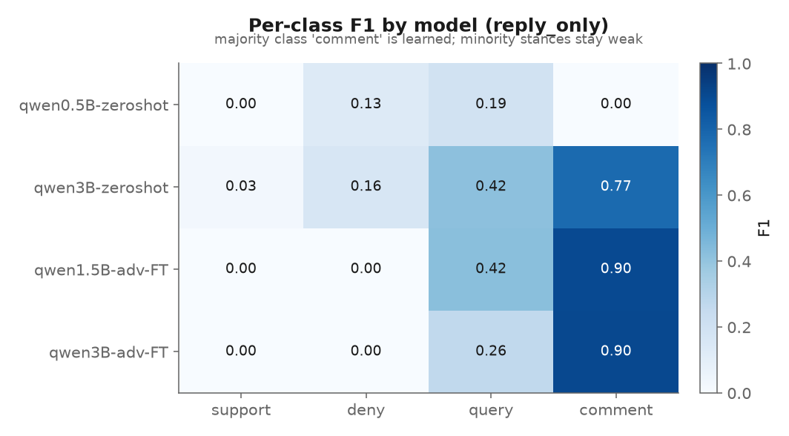
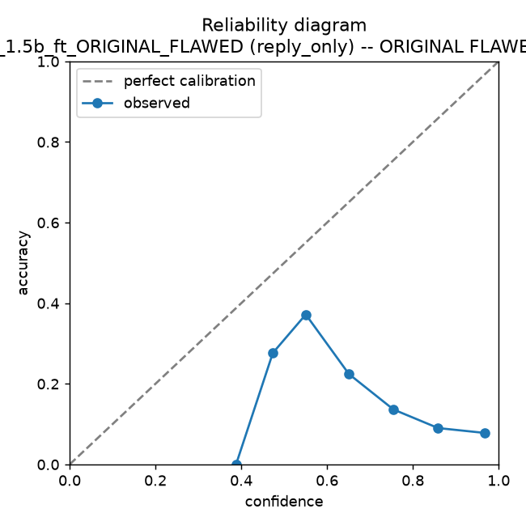

# LLM Robustness under Context Perturbation (RumourEval-2019)

[](https://github.com/NayeonKim925/llm-robustness/actions/workflows/ci.yml)


A controlled study of how small instruction-tuned language models
(Qwen2.5-0.5B / 1.5B / 3B) classify **rumour stance** (support / deny / query /
comment) when the surrounding conversational context is varied from *helpful*
to *adversarial*. The project fine-tunes LoRA adapters, evaluates them across
six context conditions, and measures both accuracy and **calibration**.

> **Scope.** This is an undergraduate research/engineering project on
> RumourEval-2019 (SemEval-2019 Task 7, subtask A). The goal is a rigorous,
> reproducible pipeline and an honest read of the results — not a publication.

---

## TL;DR — what actually holds

All numbers are recomputed from the committed prediction dumps by
`scripts/analyze_results.py`, **always next to trivial baselines**. On the dev
split the `comment` class alone is **81.6%** of examples, so the majority-class
baseline scores **0.816 accuracy** — every model number must be read against
that.

| Model (generation eval, chat-template) | acc (reply_only) | acc under *lexical* distractor | comment F1 | classes predicted |
|---|---|---|---|---|
| Qwen0.5B zero-shot | 0.096 | 0.093 | 0.00 | 2 → **class collapse** |
| Qwen3B zero-shot | 0.628 | **0.598** (worst) | 0.77 | 4 |
| Qwen1.5B adversarial-FT | 0.823 | 0.841 | 0.90 | 3 |
| Qwen3B adversarial-FT | 0.825 | **0.851** | 0.90 | 3 |

Three findings:

1. **Zero-shot small models are unreliable and imbalance-sensitive.** The 0.5B
   model collapses to 1–2 classes and never predicts the majority class
   (`comment` F1 = 0.00). The 3B model is reasonable but its **weakest point is
   exactly the adversarial `lexical` distractor** (0.628 → 0.598).
2. **Adversarial fine-tuning buys robustness.** The adv-FT models stay at
   0.82–0.86 accuracy across *all* six conditions, and the 3B model’s lexical
   vulnerability closes almost entirely (**0.598 → 0.851**). Macro-F1 stays
   modest (~0.30–0.40) because minority stances remain hard under imbalance.
3. **The original “miscalibration” finding was a measurement artifact.** It came
   from a confidence-scoring pipeline with three bugs (below). The honest status
   of the calibration claim is *“not yet established — re-run with the corrected
   `calibrate.py`.”* See [`docs/findings.md`](docs/findings.md).

The value of this repo is as much the **diagnosis of its own failure modes** as
the positive results. That story is written up in
[`docs/findings.md`](docs/findings.md).

---

## Results at a glance

All figures are regenerated from the committed prediction dumps with
`make figures` (colour-blind-safe palette; training regime also encoded by line
style so identity never rests on colour alone).

| | |
|---|---|
|  |  |
| **Accuracy across the six context conditions.** Adversarial-FT models stay flat and above the majority baseline; zero-shot 3B dips under the `lexical` distractor. | **The adversarial lexical distractor** hurts zero-shot 3B (0.628→0.598) but not adversarial-FT (0.825→0.851). |
|  |  |
| **Per-class F1.** The majority class `comment` is learned (F1 ≈ 0.90); minority stances stay weak — an honest limitation. | **Reliability diagram of the *original, flawed* confidence pipeline** — confidence far exceeds accuracy (ECE ≈ 0.80). Kept only to document the artifact (see [Bugs found and fixed](#bugs-found-and-fixed-why-the-calibration-numbers-changed)). |

---

## Research question & experimental design

**Does adding context to a stance classifier help, and does *adversarial*
context hurt — and can adversarial fine-tuning restore robustness?**

Each labelled reply is rendered under **six context conditions** (built in
`src/llm_robustness/data.py`):

| Condition | Context supplied to the model |
|---|---|
| `reply_only` | the target reply only (no context) |
| `useful` | source rumour + the direct parent reply |
| `irrelevant` | source + an on-topic but stance-free comment (lowest lexical overlap) |
| `conflicting` | source + a *real* reply taking the opposing stance |
| `mixed` | source + parent + a conflicting reply |
| `lexical` | a hard-coded distractor sentence asserting the **opposite** of the true stance (a label-aware adversarial stress test) |

This controlled-ablation design is the core idea: the same target reply is held
fixed while only the *type* of surrounding context changes, so accuracy
differences are attributable to the context manipulation.

---

## Repository structure

```
llm-robustness/
├── README.md                     # this file
├── requirements.txt              # pinned dependency ranges
├── Makefile                      # reproducible entry points
├── pyproject.toml                # installable package + split extras (viz/gpu/dev)
├── configs/experiment.yaml       # all paths, hyper-params, seed
├── src/llm_robustness/           # importable package (single source of truth)
│   ├── labels.py                 #   robust, deterministic label parsing
│   ├── metrics.py                #   F1 / accuracy / baselines / ECE / McNemar  (pure stdlib)
│   ├── data.py                   #   RumourEval parsing + 6 conditions
│   ├── prompts.py                #   chat formatting (train == inference)
│   ├── report.py                 #   baseline-anchored analysis of the dumps  (CPU)
│   ├── viz.py                    #   result figures  (CPU)
│   ├── cli.py                    #   console entry points (llmr-analyze, …)
│   ├── evaluate.py               #   generation eval  (GPU)
│   ├── calibrate.py              #   corrected calibration  (GPU)
│   └── train.py                  #   LoRA SFT + class-imbalance handling  (GPU)
├── scripts/                      # thin wrappers over the package entry points
│   ├── build_dataset.py / analyze_results.py / make_figures.py / significance.py  (CPU)
│   ├── run_finetune.py / run_eval.py / run_calibration.py   (GPU)
├── tests/                        # unit tests (labels, metrics) + conftest bootstrap
├── notebooks/                    # original exploratory notebooks (record of work)
├── results/                      # distilled metrics + raw prediction dumps
│   └── raw_predictions/          #   the GPU-produced prediction files
├── figures/                      # generated plots
└── docs/                         # methodology + honest findings write-up
```

Model weights and the raw corpus are **not** committed (see
[Data](#data) / [`.gitignore`](.gitignore)); everything needed to *reproduce*
them is.

---

## Reproducing

The project is an installable package with **split extras**, so a laptop pulls
only light deps and the CUDA box opts into the heavy ones:

```bash
pip install -e ".[viz,dev]"     # CPU: analysis, figures, tests (this is `make setup`)
pip install -e ".[viz,dev,gpu]" # + torch/transformers/peft/trl for training

# --- CPU, no GPU required ---
make test         # unit tests for labels, metrics, and the split (no leakage)
make dataset      # rebuild context_conditions.json from the raw corpus  (llmr-dataset)
make splits       # emit the deterministic train/val/test manifest       (llmr-splits)
make analyze      # recompute all metrics/baselines from the dumps        (llmr-analyze)
make figures      # render result figures                                (llmr-figures)
make significance # paired McNemar tests across conditions                (llmr-significance)

# --- GPU ---
make train  OUT=result/qwen_1.5b_ft                        # standard LoRA SFT
python scripts/run_finetune.py --adversarial \
       --output-dir result/qwen_1.5b_adv                   # adversarial FT
make eval      MODEL=Qwen/Qwen2.5-3B-Instruct OUT=results/eval_3b_zeroshot.json
make calibrate MODEL=Qwen/Qwen2.5-1.5B-Instruct \
       ADAPTER=result/qwen_1.5b_ft/final OUT=results/cal_1.5b_ft.json
```

Once installed, the CPU tools are also on your `PATH` as `llmr-analyze`,
`llmr-figures`, etc. Everything is seeded (`configs/experiment.yaml: seed`) and
paths are configurable — no hard-coded home directories, no `sys.path` hacks.

## Data

RumourEval-2019 (SemEval-2019 Task 7) is **not redistributed here** (it contains
tweet text). Download it and place the trees under
`rumoureval-2019-training-data/` so the layout matches
`twitter-english/…`, `reddit-*-data/…`, `dev-key.json`, `train-key.json`; then
run `make dataset`. The build is deterministic and yields 6,337 examples
(train 4,890 / dev 1,447); a data card is written to `results/data_card.json`.

---

## Bugs found and fixed (why the calibration numbers changed)

The original confidence/calibration pipeline reported “models are more confident
when wrong.” Re-examination showed that result was driven by three bugs, now
fixed in `src/llm_robustness/calibrate.py`:

1. **Missing chat template.** The fine-tuned *chat* model was scored on a raw
   `"Rumor: … Answer:"` string, not the `<|im_start|>…` format it was trained
   on — a silent train/inference mismatch. Fixed: all formatting goes through
   `prompts.build_inference_text`.
2. **Wrong label-token ids.** Confidence read the logits of
   `tokenizer.encode("deny")[0]` (the *no-leading-space* token), but in context
   the model emits `" deny"`, a **different** BPE id (e.g. `deny` = 89963 vs
   `" deny"` = 23101). Fixed: `calibrate.label_token_ids` scores the in-context
   tokens and asserts they are distinct.
3. **Train/dev contamination.** That pipeline’s “dev” set was built from a
   merged key map and silently included training threads (≈5,669 rows vs the
   true 1,447-example dev split). Fixed: splits are assigned per-`reply_id` in
   `data.parse_rumoureval`.

The buggy numbers are retained in `results/raw_predictions/confidence_results_*`
and quantified (ECE ≈ 0.80) **only to document the artifact**; they are not
evidence about model calibration.

---

## Limitations

- Minority stances (support/deny/query) remain hard: adv-FT macro-F1 is
  ~0.30–0.40 (published RumourEval-2019 systems reach ~0.5–0.6). The models
  predict 3 of 4 classes.
- The `lexical` condition is **label-aware** (it uses the gold stance to pick a
  contradicting sentence), so it is a controlled stress test, not a realistic
  attack.
- Evaluation uses the RumourEval `dev` split as the held-out **test** set; a
  thread-level `val` split (`make splits`) is carved from `train` for model
  selection (see [methodology](docs/methodology.md#data-splits-train--validation--test)).
  The official RumourEval *test* set is not bundled; drop it in and evaluate with
  `--split test` for an additional external check.
- The corrected `calibrate.py` has not yet been re-run on GPU here, so the
  corrected calibration table is left to be filled in — see
  [`docs/findings.md`](docs/findings.md).

## References

- Gorrell et al. *SemEval-2019 Task 7: RumourEval 2019.* SemEval 2019.
- Hu et al. *LoRA: Low-Rank Adaptation of Large Language Models.* ICLR 2022.
- Guo et al. *On Calibration of Modern Neural Networks.* ICML 2017. (ECE / reliability diagrams)
